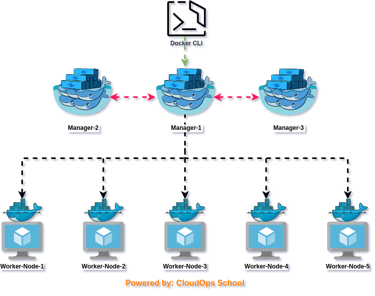

# Mastering Docker Swarm & Simplifying Container Orchestration
Table Of Content:
- [Mastering Docker Swarm \& Simplifying Container Orchestration](#mastering-docker-swarm--simplifying-container-orchestration)
  - [1.What is Docker?](#1what-is-docker)
  - [2.What is Docker daemon?](#2what-is-docker-daemon)
  - [3.Docker architecture](#3docker-architecture)
  - [4.What Is Docker Swarm?](#4what-is-docker-swarm)
  - [5. How Does Docker Swarm Work?](#5-how-does-docker-swarm-work)
  - [6. Docker Swarm Cluster Setup](#6-docker-swarm-cluster-setup)
  - [7.Deploy Your Service on Docker Swarm](#7deploy-your-service-on-docker-swarm)

In the fast-paced world of application development, efficiency is key. Docker revolutionized the scene by offering lightweight containerization as an alternative to cumbersome virtual machines (VMs).

Now, with Docker Swarm, managing clusters of Docker hosts is a breeze. This orchestration tool simplifies deployment and scaling, freeing developers from infrastructure complexities.

In this article, we'll explore Docker Swarm's architecture and practical usage. But first, let's grasp the basics of Docker containerization and its significance in modern development.

## 1.What is Docker?
Docker is a platform for developing, packaging & running applications in containers, providing a consistent and portable environment across different systems.\
It uses operating-system-level virtualization to deliver software in packages called containers

## 2.What is Docker daemon?
Docker daemon runs on the host operating system. It is responsible for running containers to manage docker services. 

## 3.Docker architecture
Docker follows Client-Server architecture, which includes the three main components that are Docker Client, Docker Host, and Docker Registry.

Docker Client: The user interface for interacting with Docker through commands or an API.

Docker Daemon (Host): A background process managing containers on the host machine.

Docker Registry: Repositories storing and distributing Docker images, like Docker Hub.

  

## 4.What Is Docker Swarm?

Docker Swarm is a container orchestration tool that allows you to manage a cluster of Docker hosts and deploy and scale containerized applications seamlessly. It forms a part of the Docker ecosystem and simplifies the management of containerized environments, making it easier for developers and operators to deploy and maintain applications at scale.

**Key Features of Docker Swarm:**
1. Orchestration: Docker Swarm automates the deployment, scaling, and management of containerized applications across a cluster of Docker hosts.

2. High Availability: It ensures high availability by distributing containerized applications across multiple nodes in the cluster, allowing for failover and redundancy.

3. Scalability: Docker Swarm enables horizontal scaling of applications by adding or removing containers based on workload demands, ensuring optimal resource utilization.

4. Load Balancing: It includes built-in load balancing capabilities to evenly distribute incoming traffic across containers running on different nodes in the cluster.

5. Security: Docker Swarm provides security features such as mutual TLS authentication and encryption to secure communication between nodes and containers within the cluster.

6. Ease of Use: With a simple and intuitive command-line interface, Docker Swarm is easy to set up and use, making it accessible to both developers and operators.

## 5. How Does Docker Swarm Work?

Docker Swarm works by orchestrating a cluster of Docker hosts, enabling users to deploy and manage containerized applications across multiple nodes seamlessly. Here's an overview of how Docker Swarm operates:

1. Initialization: To create a Docker Swarm cluster, one of the Docker hosts is designated as the manager node. This node initializes the Swarm, forming the control plane responsible for managing the cluster.

2. Joining Nodes: Additional Docker hosts can join the Swarm as either manager or worker nodes. Manager nodes handle cluster management tasks, while worker nodes execute the containerized applications.

3. Service Deployment: Users define services, which represent containerized applications along with their configurations and desired states. These services are deployed to the Swarm using Docker commands or Docker Compose files.

4. Task Scheduling: The manager node schedules tasks, which represent individual instances of services, across the worker nodes in the Swarm. Tasks are distributed based on resource availability and constraints specified by the user.

5. Load Balancing: Docker Swarm includes built-in load balancing mechanisms to evenly distribute incoming traffic among the tasks running on different nodes. This ensures optimal utilization of resources and high availability of applications.

6. Scaling: Users can scale services horizontally by adjusting the number of replicas, which determines the number of tasks running for a particular service. Docker Swarm automatically distributes these tasks across available nodes.

7. Health Monitoring: Docker Swarm continuously monitors the health of services and individual tasks within the cluster. If a task or node becomes unhealthy, Docker Swarm takes corrective actions, such as restarting tasks or rescheduling them to healthy nodes.

8. Networking: Docker Swarm provides networking features that enable communication between containers running on different nodes in the cluster. This allows for seamless interaction between services and ensures connectivity within the application architecture.

9. Security: Docker Swarm offers security features such as mutual TLS authentication, encryption of network traffic, and role-based access control (RBAC) to protect the cluster and its resources from unauthorized access and malicious activities.

  

## 6. Docker Swarm Cluster Setup

Setting up your first Docker Swarm Demo can indeed be a rewarding experience, showcasing the capabilities of containerized applications. To help you get started, here are the steps to set up your first Docker Swarm Demo.

**Basic Prerequisites for Setting Up Docker Swarm**

1. Docker Installed: Ensure Docker Engine is installed on all nodes.
2. Multiple Nodes: Need multiple machines for the Swarm cluster.
3. Network Connectivity: Nodes must communicate with each other.
4. Static IPs or Hostnames: Nodes need identifiable addresses.
5. Open Ports: Ports 2377, 7946, and 4789 should be open.
6. Consistent Docker Versions: Use the same Docker version on all nodes.
7. Sufficient Resources: Nodes should have enough CPU, memory, and disk space.

**6.1 Install Docker from [Here](https://docs.docker.com/engine/install/ubuntu/)**

**6.2 Initializing a Swarm**

Initialize Swarm\
`docker swarm init`

Initialize Swarm with specific address\
`docker swarm init --advertise-addr <MANAGER-IP>`

Generate tocken for node join as manager.\
`docker swarm join-token manager`

Generate tocken for node join as worker.\
`docker swarm join-token worker`

Forcely advertise a cluster.
`docker swarm init --force-new-cluster --advertise-addr <MANAGER-IP>`

**6.3 Joining Nodes to Swarm**

Join as a worker
`docker swarm join --token <TOKEN> <MANAGER-IP>:<PORT>`

**6.4 Managing Nodes**

List Nodes\
`docker node ls`

Inspect Node\
`docker node inspect <NODE-ID>`

Promote Node to Manager, this CMD from master node\
`docker node promote <NODE-ID>`

Demote Manager to Worker\
`docker node demote <NODE-ID>`

Remove Node from Swarm\
`docker node rm <NODE-ID>`

Node itself Leave from cluster.\
`docker swarm leave`

## 7.Deploy Your Service on Docker Swarm

---
